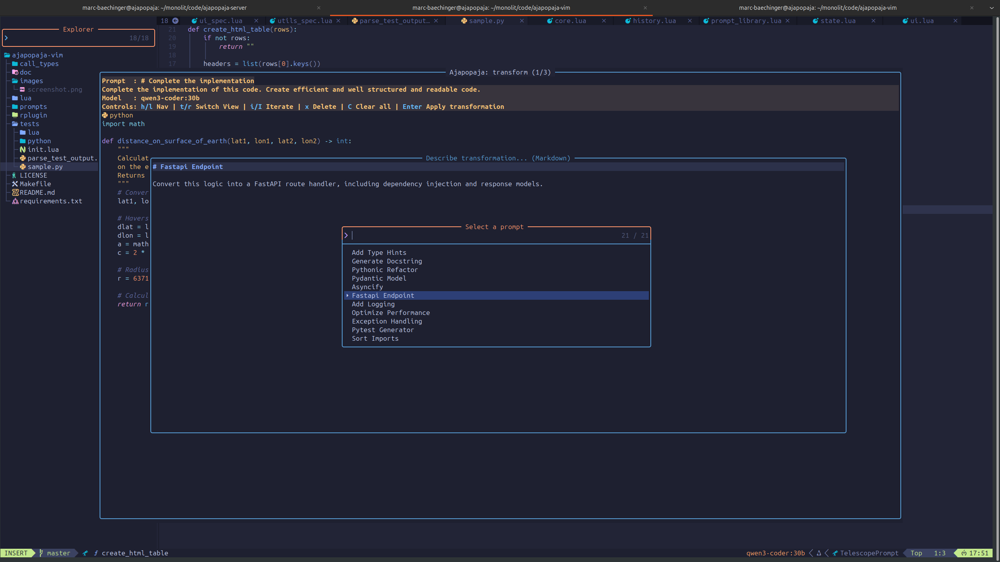

# Ajapopaja

A Neovim plugin designed to interface with local LLMs (via Ollama) for asynchronous code transformation, review, and history management.

## Contents

1. [Introduction](#introduction)
2. [Installation](#installation)
3. [Configuration](#configuration)
4. [Usage](#usage)
5. [Commands](#commands)
6. [Keybindings](#keybindings)
7. [History Management](#history-management)
8. [Prompt Library](#prompt-library)

## Introduction

Ajapopaja provides a bridge between your Neovim buffer and Large Language Models. It specializes in two main workflows:

1. **Code Transformation**: Modify selected code based on natural language or predefined prompts. Iterate on LLM responses. Replace the original selection with the transformation result or insert at cursor position.
2. **Code Review**: Provide actionable feedback on code quality and logic and LLM prompts to resolve identified issues.

All LLM calls are handled asynchronously using a Python-based RPC backend to ensure the Neovim UI remains responsive during generation.



## Installation

### Requirements

- Neovim >= 0.10.0 (Recommended)
- Python 3.10+
- Ollama (running locally or accessible via network)

### Plugin Setup (lazy.nvim)

When using lazy.nvim add  `~/.config/nvim/lua/plugins/ajapopaja.lua` and restart nvim:

```lua
return {
    "marcbaechinger/ajapopaja-nvim",
    build = ":UpdateRemotePlugins",
    config = function()
        require("ajapopaja").setup({
            -- Optional: defaults to http://localhost:11434
            ollama_host = "http://localhost:11434" 
        })
    end
}
```

### Post-Installation Steps

Ajapopaja requires a dedicated Python virtual environment containing `pynvim` and `aiohttp`. To set this up:

1. **Provision Environment**:
   Run the following command within Neovim:

   ```
   :AjapopajaBootstrap
   ```

   This creates a `.venv` folder inside the plugin directory and installs all necessary Python dependencies asynchronously.

2. **Restart Neovim**:
   A full restart is required to initialize the new Python RPC host.

### Verifying Installation

You can verify that everything is correctly configured by running:

```
:checkhealth ajapopaja
```

The health check will validate your Python provider path, Ollama connectivity, and RPC function registration.

## Configuration

The plugin is configured via the `setup()` function. Calling `setup()` is required to initialize commands and background model refreshing.

```lua
require("ajapopaja").setup({
    -- The URL where your Ollama instance is reachable.
    ollama_host = "http://localhost:11434", -- default

    -- Set to false to disable the default keybindings.
    default_keymaps = true, -- default
})
```

### Global Variables

`g:ajapopaja_ollama_host`
The host address for the Ollama API. This variable is set by the `setup()` function but can be manually overridden if needed for specific RPC calls.

### Lualine Integration

Ajapopaja provides a `get_status()` function that indicates the current active model and a loading spinner (󱚣) when the LLM is processing a request.

Recommended `lualine.nvim` configuration:

```lua
require("lualine").setup({
  sections = {
    lualine_x = {
      {
        function()
          -- Displays active model and loading state
          return require("ajapopaja").get_status()
        end,
        color = { fg = "#ff9e64" },
      },
      "encoding",
      "fileformat",
      "filetype",
    },
  },
})
```

## Usage

### Transforming Code

1. Select a block of code in Visual Line Mode (V-line) or stay in Normal Mode for the whole buffer.
2. Press `<leader>ai` (free text transformation prompt) or `<leader>as` (select standard prompt).
3. In the free form prompt window, enter your transformation request (e.g., "Refactor this into a class"). Press `<CR>` in normal mode to prompt.
4. The LLM processes the request. Once finished, use `<leader>at` to apply the transformation result to the initial selection. Alternatively, use `<leader>ap` to paste at the current cursor position in normal mode or to replace the current selection in visual mode.

When in the free text prompt window, `<leader>as` opens the prompt picker
to insert a standard prompt from the select dialog.

The last transformation result is also copied to the register 'c' and can be inserted with "cp.

Note: When `<leader>at` is used the original selection is only replaced if the selection content wasn't change in the mean time. In such a case, use `<leader>ap` to replace the current visual selection or insert at the cursor position normal mode.

### Iterate on a History Item

One of the most powerful features of the History Window is the ability to "refine" or "iterate" on a previous output. By pressing `i`, you can provide additional instructions to the LLM based on its previous response. The plugin automatically handles the context transfer, ensuring the model understands the current state of the code transformation.

### History Management

Ajapopaja maintains a persistent history of interactions.

- History items are categorized by "call type" (transform, review).
- The history window allows you to preview responses before applying them.
- Persistent storage is managed by the Python backend in `~/.ajapopaja/`.

## Commands

| Command                 | Description                                        |
|-------------------------|----------------------------------------------------|
| `:AjapopajaBootstrap`   | Initialize the Python virtual environment          |
| `:AjapopajaTransform`   | Open prompt window for selected text  |
| `:AjapopajaSelectPrompt` | Select a standard prompt                          |
| `:AjapopajaApplyLatest` | Apply the latest transformation                    |
| `:AjapopajaInsertLatest` | Insert/replace with the latest transformation     |
| `:AjapopajaReview`      | Review selected text                         |
| `:AjapopajaHistory`     | Open the history window                            |
| `:AjapopajaSelectModel` | Select the LLM to use                              |
| `:AjapopajaRefreshModels` | Refresh the list of available LLMs               |
| `:AjapopajaEditPrompts` | Open the prompt directory for editing            |

## Keybindings

| Key        | Mode | Action                                                                |
|------------|------|--------------------------------------------------------------------|
| `<leader>ai` | n, V | Prompt for transformation (`:AjapopajaTransform`)                       |
| `<leader>as` | n, V | Select from filetype-specific prompts (`AjapopajaSelectPrompt`)         |
| `<leader>at` | n    | Apply the latest transformation (`:AjapopajaApplyLatest`)               |
| `<leader>ap` | n, V | Insert/replace with the latest transformation (`:AjapopajaInsertLatest`)|
| `<leader>ah` | n    | Open the history window (`:AjapopajaHistory)                          |
| `<leader>am` | n    | Select LLM (`:AjapopajaSelectModel`)                                    |
| `<leader>aM` | n    | Refresh list of LLMs (`:AjapopajaRefreshModels`)                        |
| `<leader>ae` | n    | Edit prompts (`:AjapopajaEditPrompts`)                                  |

## History Window

The History Window is a sophisticated, interactive interface designed for browsing, managing, and applying past LLM interactions. It can be triggered via `:AjapopajaHistory` or the default mapping `<leader>aw`.

### Interaction Modes

The window operates in two primary modes, which can be toggled:

- **Transform**: For code refactors and modifications.
- **Review**: For textual feedback and code analysis.

### Navigation & Controls

| Key     | Action                                                            |
|---------|-------------------------------------------------------------------|
| `l`     | Navigate to the next history item                                 |
| `h`     | Navigate to the previous history item                             |
| `t`     | Switch view to "Transform" history                                |
| `r`     | Switch view to "Review" history                                   |
| `i`     | Iterate: Trigger a custom refinement on the current item          |
| `I`     | Standard Refine: Use a library prompt to refine the current item  |
| `x`     | Delete the current history entry                                  |
| `C`     | Clear all history for the current view (Transform or Review)      |
| `<CR>`  | Apply: (Transform only) Replace buffer text with this result      |
| `q`     | Close the history window                                          |

## Prompt Library

Ajapopaja uses a filetype-aware prompt library. This allows you to define specialized instructions for different programming languages.

### Prompt Storage

Prompts are stored as Markdown files in the `/prompts` directory of the plugin root:

- `default.md`    (Fallback for any filetype)
- `python.md`     (Python specific prompts)
- `javascript.md` (JavaScript specific prompts)
- `lua.md`        (Lua specific prompts)

### Markdown Format

Each file contains one or more prompts. A prompt starts with a top-level heading (`#`) which acts as the title displayed in the selection UI. All text following the heading until the next heading is treated as the prompt content.

Example `python.md`:

```markdown
# Add Docstring
Write a Google-style docstring for this Python function. 
Include Args, Returns, and Raises sections.

# Refactor to Type Hints
Add PEP 484 type hints to this code. Ensure all function 
signatures and variables are explicitly typed.
```

### Behavior and Fallbacks

When you trigger the prompt selection UI (`<leader>as`):

1. The plugin detects the current buffer's 'filetype'.
2. It looks for a corresponding `.md` file in the `/prompts` directory.
3. If the specific file does not exist, it falls back to `default.md`.
4. Prompts are cached in memory after the first read to ensure the UI remains snappy.

### Customizing Prompts

To add your own prompts, simply create a Markdown file named after the language's filetype in the plugin's `prompts/` directory. If you are using a plugin manager like `lazy.nvim`, you can find this path via:

```lua
print(vim.api.nvim_get_runtime_file("prompts/default.md", false)[1])
```

## License

MIT
